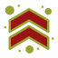
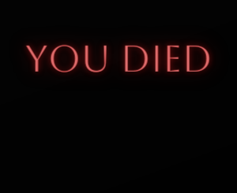

## **Links asociados al proyecto:**

link Codigo

https://github.com/MINIATX/proyectofinaldickasonbrian.git

link Pages

https://miniatx.github.io/proyectofinaldickasonbrian/

link subida al servidor

proyectofinaldickasonbrian-miniatx.vercel.app

proyectofinaldickasonbrian.vercel.app

proyectofinaldickasonbrian-git-master-miniatx.vercel.app

### **Inspiracion en el proyecto** 

La pagina se encuentra inspirada en un video juego llamado BloodBorne desarrollado para la consola Play Station 4 en su lanzamiento en el año 2015. El mismo es un desarrollo inspirado en otros juegos de dinamica Dark Soul, pero con fuertes diferencia que lo hacen mas dinamico y con un alto nivel de dificultad. Este se situa en una ciudad llamada Yharnam, donde la Iglesia de Sanacion descubrio un antidoto ( viales sangre) que cura todas las enfermedades y dolencias de aquellos que las padecen. Dicha sangre convierte a los pacientes en bestias, con el transcurso de la aplicacion del mismo. Lo que da lugar al surgimiento de los cazadores en respuesta a la constante aparicion de bestias, nuestro personaje sera un cazador que vive en una pesadilla en el transcurso del juego. Dicha pesadilla solo dura una noche de caceria en la que se desenvuelve toda la trama del juego.

### **Herramientas utilizadas en el proyecto**

En el desarrollo del proyecto se utilizaron diversas herramientas que se describen a continuacion:

-HTML 5

-CSS 3

-Sass

Frameworks:

-Bootstrap 5

### **Desarrollo del proyecto**

Paleta de colores

mainColor: rgb(4, 4, 4)

secondaryColor: rgb(150, 20, 20)

thirdColor: rgb(249, 248, 244)

fourthColor: rgb(219, 219, 217)

fivethColor: rgb(163,154,49)

Estos colores fueron seleccionados de dentro de la paleta de colores del mismo juego para que el usuario se sienta inmerzo en la atmosfera de BloodBorne.

### **Diseños desarrollados para el proyecto**

#### **Favicom**

Se diseño un favicom especial para el proyecto que se adapte a la tematica de la pagina y el mismo sea visible de formma adecuada desde cualquier navegador y con formato SVG para evitar la distorcion de la imagen.

#### **Boton Hamburguesa**

Se diseño un boton hamburguesa que siguiera la tematica de colores seleccionada para el proyecto dandole un toque personalizado que permita resaltar del resto y rompiendo con el estandar ofrecido por Bootstrap.

#### **Boton Footer**

Se diseño un boton para el footer que te desplaza hasta el header. El mismo tiene la paleta de colores seleccionada para el proyecto. La desicion de implementar este boton es debido al volumen de contenido de la pagina evitando asi que el usuario debe scrollear excesivamente para volver al inicio.

#### **Imagen para pagina 404**

Se diseño una pagina 404 inspirada en la pantalla que aparece cuando sos asesinado por las bestias o moris por algun otro motivo. Se puede llegar a la misma presionando alguno de los botones contenido en la pagina de "Join Us". A su vez esta pagina tiene el logo de la pagina que te devuelve al index.

### **Galeria de Imagenes**

La galeria de imagenes cuenta con 18 imagenes desarrolladas en un layout complejo con la tecnica GRID ( breakpoints 1200px, 768px y 300px ), que a su vez cambia la dispocion de las imagenes de la galeria con las diferentes resoluciones. Todas las imagenes estan optimizadas al formato "WEBP" para que las mismas sean livianas de cargar para usuarios con una banda mas estrecha. La galeria tambien se aplica el Lightbox Fresco para poder ampliar a las mismas y verlas con mayor detalle. Dentro de la galeria se encuentran imagenes del juego como asi tambien trabajos artisticos creados por los fanaticos del juego.

